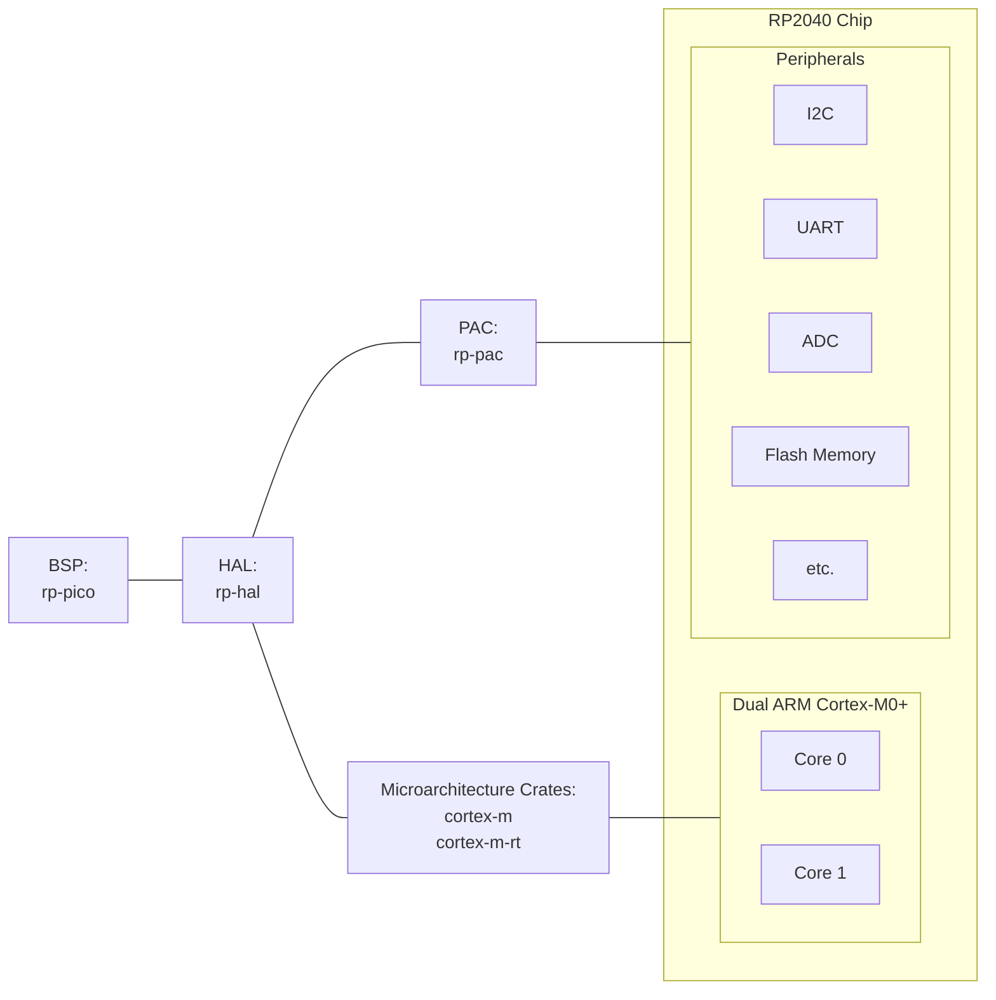

# Levels of abstraction

# Justifications For Abstraction

As you may have noticed, it is extremely cumbersome and error prone to directly interface with the hardware registers. Programming in this way requires knowledge of the specific chipset you are working on and the board in which it is being deployed to. If the chipset were to change even slightly, even to a model that has the same processor cores, it is likely that the addresses associated with hardware registers would be different.

The way to get around these issues is through layers of abstraction, for the Raspberry Pi Pico the layers are as follows:
- [Peripheral Access Crate (PAC)](https://crates.io/crates/rp2040-pac/)
- [RP Hardware Abstraction Layer (HAL)](https://crates.io/crates/rp2040-hal)
  - Based on this generalized interface: [Embedded HAL](https://crates.io/crates/embedded-hal)
- [Board Support Package (BSP)](https://crates.io/crates/rp-pico/)

The following flowchart displays how these crates interact with the BSP being the highest level of abstraction and the chip itself being displayed by its individual block components. 


# Programming with a BSP

The first step of starting with this BSP is importing all of the necessary new dependencies into our project:

`Cargo.toml`
```toml
...

[dependencies]
# For ARM M-Series microcontrollers
cortex-m = "0.7"
cortex-m-rt = "0.7"
embedded-hal = { version = "1.0.0" }

# Debug probe printing
defmt = "0.3"
defmt-rtt = "0.4"

# Panic handler
panic-probe = { version = "0.3", features = ["print-defmt"] }

# Board support package (BSP)
rp-pico = "0.9"

...
```

With the addition of a BSP we are also adding support for RTT. With RTT and SWD we can switch from `panic-halt`, which gives no information about why a panic happened to the developer, to `panic-probe` which takes advantage of the existence of the debug probe to display the cause of panics and a stack trace.

`main.rs`
```rust
#![no_std]
#![no_main]

use bsp::entry;
use defmt::info;
use defmt_rtt as _;
use embedded_hal::digital::OutputPin;
use panic_probe as _;

use rp_pico as bsp;

use bsp::hal::{
    clocks::{init_clocks_and_plls, Clock},
    pac,
    sio::Sio,
    watchdog::Watchdog,
};

#[entry]
fn main() -> ! {
    ...
}
```

Note how we aliased `rp_pico` to `bsp`, this is to support portability between multiple boards. If you were switching to another board, e.g. the RP Pico W, you would only have to update that alias and your included dependencies.

Next is to start to instantiate the different data structures we are going to use. Due to Rust's strict ownership requirements, care must be taken to who has ownership of any single hardware resource at a time. 

`main.rs`
```rust
...
#[entry]
fn main() -> ! {
    let mut pac = pac::Peripherals::take().unwrap();
    let core = pac::CorePeripherals::take().unwrap();
    let mut watchdog = Watchdog::new(pac.WATCHDOG);
    let sio = Sio::new(pac.SIO);

    ...
}
```

Notice how the PAC first takes ownership of all of the hardware peripherals, this crate contains all of the information such as memory addresses but none of the information about how to utilize these resources. The PAC is, in simple terms, a crate that closely models the data sheet's representation of the hardware, this includes splitting most of the registers into named bitfields and giving convenient ways to access them. However, the PAC does not even attempt to stop you from doing something like enabling incompatible features, that is done by the HAL. 

Next we will use the data structures that are now owned by the PAC to setup the clock for use in a delay later.

`main.rs`
```rust
#[entry]
fn main() -> ! {
    ...

    // External high-speed crystal on the pico board is 12Mhz
    let external_xtal_freq_hz = 12_000_000u32;
    let clocks = init_clocks_and_plls(
        external_xtal_freq_hz,
        pac.XOSC,
        pac.CLOCKS,
        pac.PLL_SYS,
        pac.PLL_USB,
        &mut pac.RESETS,
        &mut watchdog,
    )
    .ok()
    .unwrap();

    let mut delay = cortex_m::delay::Delay::new(core.SYST, clocks.system_clock.freq().to_Hz());
    
    ...
}
```
This setup ensures that the clocks are properly configured and exposed a data structure `delay` that wraps that functionality in something is simple to use.

Next is doing the same thing for the LED output pin, remember the work that needed to be done to set the pin as an output before it was even driven high or low. Notice how that setup is handled via Rust's type system.
```rust
#[entry]
fn main() -> ! {
    ...

    let pins = bsp::Pins::new(
        pac.IO_BANK0,
        pac.PADS_BANK0,
        sio.gpio_bank0,
        &mut pac.RESETS,
    );

    let mut led_pin = pins.led.into_push_pull_output();

    ...
}
```

With this, the `led_pin` is configured in hardware to be ready for a push/pull output. If this operation was not done, the methods to operate on that pin would not exist as it would be the incorrect type. By leveraging Rust's type system, improperly configuring a pin becomes significantly more difficult than miscalculating a bitmask.

Finally, we will use the newly constructed `led_pin` struct to control the on-board LED.

```rust
#[entry]
fn main() -> ! {
    ...

    loop {
        info!("on!");
        led_pin.set_high().unwrap();
        delay.delay_ms(500);
        info!("off!");
        led_pin.set_low().unwrap();
        delay.delay_ms(500);
    }

    ...
}
```

With this we can finally control the on-board LED without having to dive into pages of datasheets or hand calculate offsets and bitmasks. We also can rest easy that the configuration of our processor and output pins is correct as proven by the type system.

# Conclusions

I hope you can see the pattern emerging when comparing the first "bare metal" binky program to this one written with the BSP. It is important to remember that the hardware changes that were done by hand still need to be done whether we see them or not, in this case we are configuring those same hardware elements for an output pin when we are converting between types. Depending on your application this level of abstraction may be intrusive and too vague for what you need, perhaps you need to know with 100% certainty the specific number of clock cycles between when a pin is configured to an input and when it is read. If that is a requirement of your work then you have no choice but to program at a level that gives you access to that data. However, for many projects, doing our best to ignore the fact that we are running code on a real physical device is beneficial. It reduces the cognitive load of the developer and allows for more portable applications that can be easily moved to new microcontrollers. 

